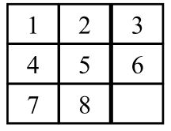

# A Star Puzzle Solver

A TypeScript lib that solves Puzzle Game problem using the A* Algorithm

## Installation

Use the package manager [npm](https://www.npmjs.com/) to install A* Puzzle Solver.

```bash
npm install a-star-puzzle-solver
```

## How to use

### ES6

```js
import AStarPuzzleSolver from 'a-star-puzzle-solver';

const solution = AStarPuzzleSolver.solvePuzzle(state);
```

### CommonJS

```js
const AStar = require('a-star-puzzle-solver').default;

AStar.solvePuzzle(state);
```

### UMD in Browser

```html
<!-- to import non-minified version -->
<script src="a-star-puzzle-solver.umd.js"></script>

<!-- to import minified version -->
<script src="a-star-puzzle-solver.umd.min.js"></script>
```

After that the library will be available to the Global as `AStarPuzzleSolver`. Follow an example:

```js

const aStar = AStarPuzzleSolver;

const solution = aStar.solvePuzzle(state);
```

## Methods
> This library provides only one method:

### solvePuzzle(initialState)
> Solves the 8 Puzzle Game with provided initial state.

**Arguments**

| Argument | Type    | Options           |
|----------|---------|-------------------|
|`initialState`|*Array of Arrays of Number* | 'Any state possible'|

**Example**

```js
const state = [
    [1, 2, 3],
    [4, 5, 6],
    [7, 0, 8]
];

const solution = AStar.solvePuzzle(state);
```

**Return**
> This method return an object with: 
> - 'state' property: last state visited (the goal state)
> - 'evaluationFunctionValue': an object (wich you can use to access property 'g' that represents the depth traveled)
> - 'previousNode': another Node object with same properties (that you can use to see expanded nodes and operations applied)

**Obs:**
- For more examples of how to use, see './examples' folder
- The goalState considered by the algorithm is:




## Contributing
Pull requests are welcome. For major changes, please open an issue first to discuss what you would like to change.

Please make sure to update tests as appropriate.

## License

This project is licensed under the MIT License - see the [LICENSE.md](LICENSE.md) file for details